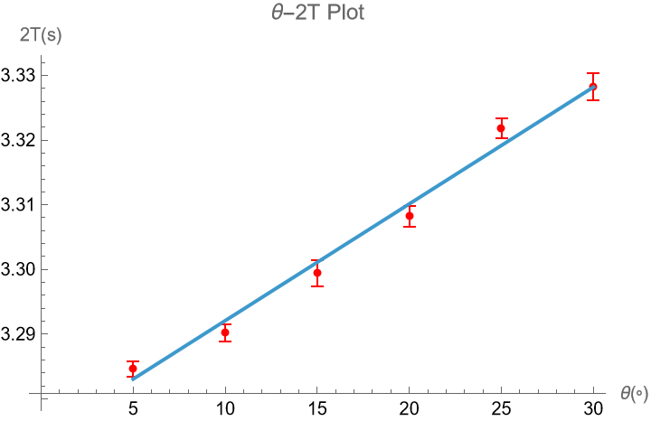
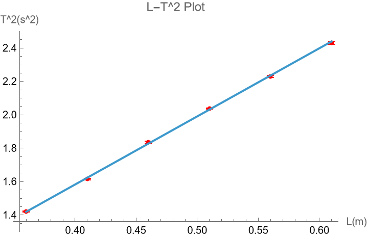

# 固定摆长，改变摆角

$\theta=5^\circ$,
$\overline{2T}=3.2846$,
$\sigma_{2T}=0.000547723$,
$\sigma_{\overline{2T}}=0.000244949$,
$\Delta_A=0.000624404$,
$\Delta_B=0.00095$,
$U=0.00113683$,
$2T=3.2846\pm 0.0011s$,
无粗差

$\theta=10^\circ$,
$\overline{2T}=3.2902$,
$\sigma_{2T}=0.00083666$,
$\sigma_{\overline{2T}}=0.000374166$,
$\Delta_A=0.000953792$,
$\Delta_B=0.00095$,
$U=0.00134619$,
$2T=3.2902\pm 0.0013s$,
无粗差

$\theta=15^\circ$,
$\overline{2T}=3.2994$,
$\sigma_{2T}=0.00151658$,
$\sigma_{\overline{2T}}=0.000678233$,
$\Delta_A=0.0017289$,
$\Delta_B=0.00095$,
$U=0.00197271$,
$2T=3.2994\pm 0.0020s$,
无粗差

$\theta=20^\circ$,
$\overline{2T}=3.3082$,
$\sigma_{2T}=0.00109545$,
$\sigma_{\overline{2T}}=0.000489898$,
$\Delta_A=0.00124881$,
$\Delta_B=0.00095$,
$U=0.00156908$,
$2T=3.3082\pm 0.0016s$,
无粗差

$\theta=25^\circ$,
$\overline{2T}=3.3218$,
$\sigma_{2T}=0.00109545$,
$\sigma_{\overline{2T}}=0.000489898$,
$\Delta_A=0.00124881$,
$\Delta_B=0.00095$,
$U=0.00156908$,
$2T=3.3218\pm 0.0016s$,
无粗差

$\theta=30^\circ$,
$\overline{2T}=3.3282$,
$\sigma_{2T}=0.00164317$,
$\sigma_{\overline{2T}}=0.000734847$,
$\Delta_A=0.00187321$,
$\Delta_B=0.00095$,
$U=0.00210034$,
$2T=3.3282\pm 0.0021s$,
无粗差

作 $\theta-2T$ 图，拟合直线：$y=3.27403 +0.00180567 x$

$$T=\dfrac{y_0}{2}=1.63701s$$

$$g=\frac{4 \pi ^2 L}{T^2}=9.892m/s^2$$

# 改变摆长

$L1=35cm$,
$\overline{2T}=2.3844$,
$\sigma_{2T}=0.00270185$,
$\sigma_{\overline{2T}}=0.0012083$,
$\Delta_A=0.00308011$,
$\Delta_B=0.00095$,
$U=0.00322329$,
$2T=2.3844\pm0.0032s$,
无粗差

$L2=40cm$,
$\overline{2T}=2.5416$,
$\sigma_{2T}=0.00288097$,
$\sigma_{\overline{2T}}=0.00128841$,
$\Delta_A=0.00328431$,
$\Delta_B=0.00095$,
$U=0.00341894$,
$2T=2.5416\pm0.0034s$,
无粗差

$L3=45cm$,
$\overline{2T}=2.7092$,
$\sigma_{2T}=0.0054037$,
$\sigma_{\overline{2T}}=0.00241661$,
$\Delta_A=0.00616022$,
$\Delta_B=0.00095$,
$U=0.00623304$,
$2T=2.702\pm0.006s$,
无粗差

$L4=50cm$,
$\overline{2T}=2.8554$,
$\sigma_{2T}=0.00219089$,
$\sigma_{\overline{2T}}=0.000979796$,
$\Delta_A=0.00249761$,
$\Delta_B=0.00095$,
$U=0.00267219$,
$2T=2.8554\pm0.0027s$,
无粗差

$L5=55cm$,
$\overline{2T}=2.9870$,
$\sigma_{2T}=0.00324037$,
$\sigma_{\overline{2T}}=0.00144914$,
$\Delta_A=0.00369402$,
$\Delta_B=0.00095$,
$U=0.00381422$,
$2T=2.987\pm0.004s$,
无粗差

$L6=60cm$,
$\overline{2T}=3.1180$,
$\sigma_{2T}=0.00514782$,
$\sigma_{\overline{2T}}=0.00230217$,
$\Delta_A=0.00586851$,
$\Delta_B=0.00095$,
$U=0.00594491$,
$2T=3.118\pm0.006s$,
无粗差

作 $L-T^2$ 图，拟合直线：$y= -0.0499542+4.08167 x$

$$k=4.08167$$

$$g=\frac{4 \pi ^2}{k}=9.672m/s^2$$

# 小摆长

$L=10cm$,$20T=13.01\pm0.05s$

$L=15cm$,$20T=15.945\pm0.012s$

$L=20cm$,$20T=17.459\pm0.015s$

$T'=T\left[1+\frac{1}{20}(\frac{d}{L})^2\right]$，小摆长下 $T$ 偏大，重力加速度值偏小。

# 误差分析

法一测得 $g_1=9.892m/s^2$，与实际值 $g_0=9.794m/s^2$ 相比误差为 $\frac{|g_1-g_0|}{g_0} \approx 1.0\%$。

法二测得 $g_2=9.672m/s^2$，与实际值 $g_0=9.794m/s^2$ 相比误差为 $\frac{|g_2-g_0|}{g_0} \approx 1.2\%$。

两种方法测得的重力加速度均较接近实际值。

# 思考题

原因测30T是可降低人眼和手的反应时间误差，减小随机误差。本实验中不用测30T只需测2T，因为采用了自动计时装置，不存在人为的反应时间误差；且需要研究大摆角下的周期公式，测量时要尽量减少空气阻力导致的阻尼衰减，因此测量周期数越少越好。